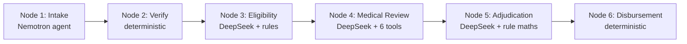

# AutoClaim AI

**Six AI agents settle an insurance claim end-to-end — no human in the loop.**

A six-node autonomous pipeline that ingests a health-insurance claim (hospital bill,
discharge summary, pre-auth), validates the policy, checks eligibility, reviews the
medical coding, adjudicates the cost-share maths, and disburses payment — each node an
LLM agent or a deterministic guardrail, every decision traceable back to the source
document.

[](https://lee1613.github.io/LLM-microservice/demo/)
· Built for the **AI Agent Olympics**
· [](LICENSE)

> **Note on the demo:** the hosted demo is *captured playback* of real pipeline runs —
> reliable on camera and deployable anywhere with zero backend. The backend is real and
> works; run it live locally (below). Hosted live inference is on the roadmap.

<!-- Record the screen-capture of the demo into this GIF. -->


## What it does

- **Reads real claim documents** — a Nemotron reasoning agent parses the hospital bill,
  discharge summary and pre-auth into structured, typed fields.
- **Reasons *and* enforces rules** — DeepSeek agents interpret plan limits and medical
  coding, while deterministic Python guardrails can override any model verdict (exclusion
  codes, exhausted limits, invalid licences).
- **Shows its work** — every node emits an inspectable trace, and the adjudication engine
  produces a line-by-line cost-share receipt that conserves to the billed total.

## Pipeline



Each node's JSON `_output` is passed forward as the next node's input; Pydantic schemas
carry every field through the whole pipeline. See the five worked scenarios:

| Scenario | Case | Outcome |
|----------|------|---------|
| B001 | Pneumonia hospitalisation, GOLD | **APPROVED** · SGD 14,962.50 disbursed |
| B002 | Hypertension outpatient, SILVER | **APPROVED · SGD 0** — zero-benefit (base absorbed by deductible) |
| B003 | Normal delivery maternity, GOLD | **DENIED @ Node 3** — maternity waiting period not met |
| B004 | Appendectomy surgical, BRONZE | **APPROVED** · SGD 1,120.00 disbursed |
| B005 | Fracture emergency, GOLD | **DENIED @ Node 2** — duplicate of an already-paid claim |

---

<details>
<summary><b>How the agents reason</b></summary>

Two nodes run *agentic tool-loops* rather than single prompts:

- **Node 1 (Intake)** — a Nemotron reasoning model calls a `parse_pdf_file` tool to read
  the claim documents, then returns structured JSON.
- **Node 4 (Medical Review)** — a DeepSeek agent calls six tools: provider registry,
  physician SMC register, ICD-10 validation, CPT lookup, RPS benchmark, and pre-auth check.

Every JSON-returning call is wrapped by `call_llm_with_json_retry` — a 3-retry reflection
loop that feeds parse errors back to the model and strips `<think>` tags and markdown
fences from reasoning-model output. Nodes 3 and 5 use DeepSeek to interpret the plan
document (limits, waiting periods, deductible/co-pay/co-insurance parameters).

</details>

<details>
<summary><b>Deterministic guardrails over the LLM</b></summary>

The model proposes; deterministic Python disposes. Guardrails **override any LLM verdict**:

- **Exclusion ICD ranges** (cosmetic, self-inflicted, substance abuse, war) → force
  `eligible = False` regardless of the model.
- **`annual_limit_remaining <= 0`** (computed from the ledger) → force `eligible = False`.
- **Medical failure priority** — invalid physician licence → pre-auth failure →
  invalid/implausible CPT codes.

Nodes 2 (Verify) and 6 (Disbursement) are *wholly* deterministic — no LLM in the path.
This is a deliberate safety design, not a gap: the demo tags every trace step `AI` or
`RULE` so you can see exactly where a model decision was gated by a rule.

</details>

<details>
<summary><b>Traceability</b></summary>

- Pydantic schemas carry each field forward node → node; nothing is re-derived downstream.
- Every stage records the parameters it interpreted and the verdict it reached.
- The demo's playback is validated field-by-field against golden contracts
  (`claim_B00{1..5}_full_pipeline.json`); the adjudication receipt conserves
  (`payout + liability = billed`).

</details>

<details>
<summary><b>Run it live locally</b></summary>

The backend is real. To run a true end-to-end LLM pass:

```powershell
# 1. Install deps into a venv
python -m venv .venv
.venv\Scripts\pip install -r requirements.txt

# 2. Provide your inference key
#    .env:  VULTR_SERVERLESS_INFERENCE_API_KEY=<key>

# 3. Run the API
.venv\Scripts\uvicorn app.main:app --reload --host 0.0.0.0 --port 8000

# 4. Explore at http://localhost:8000/docs
#    or run a full six-node QC pass against the live models:
.venv\Scripts\python.exe test\qc_pipeline_b001.py
```

</details>

<details>
<summary><b>Tech stack &amp; roadmap</b></summary>

**Stack:** FastAPI / Python · Vultr Serverless Inference (Nemotron reasoning +
DeepSeek) · SQLite ×3 · vanilla-JS static demo · Kubernetes (VKE).

**Roadmap:**
1. **RAG cross-referencing** — replace Node 4's deterministic registry/CPT lookups with
   retrieval against payer-policy corpora. (The hard part; deterministic today.)
2. **Hosted live inference** — the demo is captured playback for on-camera reliability;
   hosting the live pipeline is the next milestone.

</details>

---

For the full six-node breakdown, model table, database schema, guardrail logic and
deployment notes, see **[docs/ARCHITECTURE.md](docs/ARCHITECTURE.md)**.
